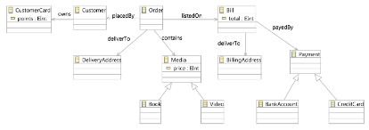
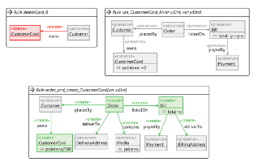
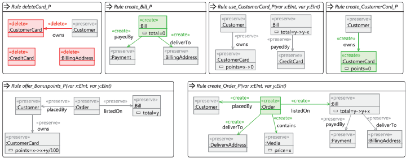
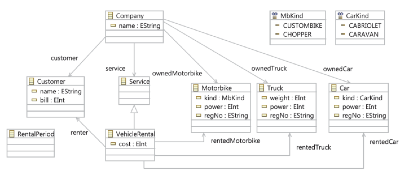
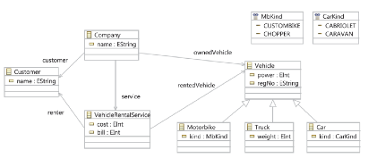

# Exercises

This collection of [exercises](GTSEBookExercisesEN2.docx) for some of the material in the book represents a first collection, to which we plan to add in the future. Solutions for educators are available on request

Please post your own exercises or ask questions in the comments below.

## A Simple Stack
Use a tool such as Groove_[1]_ or Henshin_[2]_ to model a stack as a simple data structure with associated operations push and pop. Since we are interested in system states and state transitions, we will neglect the operation top at this point, where the underlying data structure does not change.
Simulate the use of the stack you have modelled manually. In Groove, you can also have part of the state space generated automatically.

## Leader Election
Create a graph transformation system for the Leader Election Problem_[3]_.

### Definition
In a distributed system several processes are connected in a unidirectional ring. These processes can only communicate by exchanging messages. To coordinate shared tasks, however, a coordinator must be appointed.

### Algorithm
Each process requires a unique ID. The role of the coordinator shall be taken over by the process with the lowest ID. To determine the leader, all processes send a message containing their ID to their neighbour. If a process receives a message, it compares the ID received to its own. If the received ID is larger, it discards the message. If it is smaller, it forwards the message to its neighbouring process. If it receives its own ID, it has the lowest ID and thus coordinates the further procedure.
Since this is a distributed system, all processes can send messages concurrently and asynchronously.

## Binary Trees

Create a graph transformation system that represents the data structure of a binary tree. In order to prevent the tree from degenerating, the following special requirement applies. A child node may only be appended to a node if its parent node is full, that is, if it already has two child nodes. An exception to this rule is of course the root of the tree. Your system should support the addition and removal of nodes as operations. You can use several rules to implement a single operation. 

## Monkey and Bananas
A monkey enters a room via the door. In the room, near the window, is a box. Next to the wall hangs a banana from the ceiling. The monkey can grab the banana after moving the box next to the wall and climbing on to it.
For each state in the experiment, we record:
* position of the monkey (door, window, wall, …) 
* position of the box
* position of the banana
* if the monkey is on the box
* if the monkey has got the banana

Questions
1. create a suitable type graph with node and edge types, attributes, inheritance, and cardinality constraints
2. create instance graphs for the situations at the start and successful completion of the experiment; make sure they are consistent with the type graph
3. list the operations performed by the monkey
4. create graph transformation rules to specify the operations and simulate their application to get from the start to the end graph

## Rucksack Problem
Create a graph transformation system that specifies a variant of the rucksack problem. In this version, the value of objects packed into a rucksack is to be maximized under the constraints that:
* The total value of all objects must not exceed the volume of the rucksack
* A given number for each type of object must not be exceeded 
* There are additional conditions on the dependencies between objects implying that, if an object is included, its dependent objects are included as well.
Design a type graph and a set of graph transformation rules in Groove that model the addition and removal of objects from the rucksack. The following conditions should be met:
* The volume of the rucksack should be V = 40. 
* There are four types of objects with property vectors (value, volume, frequency) given by [(5, 10, 3), (4, 7, 3), (3, 4, 2), (4, 7, 2)]. 
* The following additional conditions are always satisfied:
  * The number of objects in the rucksack of the first type equals the number of objects of the third type.
  * If there is an object in the rucksack of the second type, then there is also one of the third type.
  * If there is an object in the rucksack of the fourth kind, then there is no object of the second type.
Design a rule system that allows you to add or remove any objects to or from the rucksack if the operation maintains the constraints and invariants, i.e., neither exceeds the volume of the rucksack nor the allowed number of objects of each type, and does not violate the invariants.

## Elevator Control: Dependencies and Conflicts
Create a graph transformation system that models the control of an elevator. The elevator should be located in a building where the main hub is on the lowest floor (for example, a car park access or main entrance). The control system should therefore be optimized to transport elevator users to and from this floor as efficiently as possible. Each floor of the building has a button to call the elevator (external request). The elevator itself also has one button per floor, which passengers can use to direct the elevator to their target floor (internal request). There can only be one internal and one external request for each floor at a time. 
If the elevator passes a floor with an internal request, the elevator stops there. An external request from a floor only leads to a stop if the passes that floor on the way down. As long as there are still requests to be processed (internal or external) in the current direction of travel, the elevator does not change direction. Both internal and external requests are not deleted until the elevator has satisfied them.

### Manual Analysis
Examine your solution to the Elevator Control system.

#### Questions
1. Which dependencies between the actions of the elevator are already apparent from the textual description? Give an example of two parallel independent actions and two sequentially dependent actions and describe their independence or dependency informally.
2. Model the elevator control as a typed attributed graph transformation system.
3. Describe (informally but in detail) how the dependencies and independence described in Question 1 are reflected in your rules you have created or, if they are not reflected, explain why not.

**Note:** Parallel independence means that both actions can be executed in any order or in parallel. A sequentially dependency exists if the execution of one action is only possible if the other action is executed before.

### Critical Pair Analysis
Examine your solution to the Elevator Control system through critical pair analysis.

#### Questions
1. Create the matrix of critical pairs for the transformation system, specifying the number of conflicts between a pair of rules in each cell of the matrix.
2. Select three cells (rule pairs) and give a sample critical pair for each of them.
3. For each critical pair from Question 2 specify the elements that cause the conflict and explain how they do so. State and explain whether this critical pair is confluent. 

## Mobile Network: Conflicts, Application Conditions and Constraints
In this assignment you shall develop a graph transformation system with constraints and application conditions modeling a network with mobile devices.

Type ad Instance Graph:

In the figure above on the left, the type graph of our system is shown, a nomadic wireless network like a mobile phone network or wireless LAN. Stations linked by a geographic neighborhood relation, form the static part of the network. To communicate with mobile devices, signals are broadcast and connections may be established. 
The idea is that a Device receiving the signal of a Station (because it is in range) may establish a connection. On the right, Fig. 1 shows a sample instance graph over the type graph, a state with two stations and two devices with the right device receiving the signal of and maintaining a connection with the right-hand side station.

### Task 1 
Define transformation rules for the following operations. (Use application conditions where appropriate.)
1. Movement of devices into the range of stations;
2. Movement of devices out of the range of stations;
3. Creation of connections if a signal is available;
4. Loss of connections if no signal is available;
5. Handover to ensure continuous connectivity when moving between adjacent cells.
 
### Task 2
Define, by means of a 5 x 5 matrix, all potential conflicts between these rules. Depict for three of these conflicts a corresponding critical pair, i.e., a graph where both rules are applicable, but not parallel independent. Give a brief interpretation of the conflicting situation.

### Task 3 
Model the following two conditions as graphical constraints:
a) no device has two signals from the same station;
b) every device is connected to at most one station at a time.
 
### Task 4
Derive negative application conditions for all rules to ensure that consistency with respect to constraints a) and b) is preserved. 

## Shopping with Bonus
In this Exercise we extend the example from Chapter 5 of the requirements specification for a shop with a bonus point system.
Buy goods: customer view 
The customer takes a trolley and takes from the shelves all the goods they want to buy. An invoice is created. If desired, 1% of the invoice amount is credited for new bonus points (i.e., one point worth one cent for every whole Euro spent) and the existing points are deducted from the invoice amount. After the purchase, the goods belong to the customer.
Sell goods: sales view 
The seller issues an invoice and adds all goods of the customer to the invoice. If all goods are on the invoice, the seller credits 1% of the invoice total and settles the old bonus points with the current invoice total. They then close the invoice and collect the money. The goods now belong to the customer and no longer to the shop.
Consider a class model that adds a bonus card to the shop, and update the activity diagrams and rules shown in Chapter 5. Make sure to add an action to create a bonus card for customers if they don’t own one already.
1. Examine the updated activity diagrams for newly created conflicts and dependencies. Decide whether these are positive or negative signs.
2. Resolve problematic or lacking conflicts or dependencies by adapting or adding rules.

## Service Matching for Book and Video Sales
Assume the following ontology for selling books and videos. A service requestor searches for the following three services and finds a provider that offers the seven services shown below. Specify which of the three services requirements the provider can satisfy, using incremental matching where needed. Justify your answers by showing how the necessary mappings are defined or which mappings may not exist, and why.

Ontology:

Requested Services:

Provided Services:

## ER Diagrams: Metamodel and Grammar
In analogy to the procedure in Chapter 10, design a domain-specific modelling language for Entity Relationship Diagrams. Proceed with the following steps:
1. Specify a metamodel (with multiplicities) that defines the abstract syntax.
2. Formalize the constraints that are to apply to the language but that cannot be expressed by the metamodel.
3. Develop a grammar (start graph and rules) that allows to generate all entity relationship diagrams that do not violate the constraints.
In addition, instances of each element of the metamodel should also be able to be generated.
The structure of simple entity relationship diagrams is as follows:
* There are entities, relationships and attributes
* Entities have attributes.
* Relationships link entities.
* A relationship can be of type relationship, generalization or aggregation.
* While links and aggregations are undirected, generalizations are directed.
In addition, the following conditions should apply to entity relationship diagrams:
* There is at least one entity.
* A relationship may only link more than two entities if it is of type aggregation.
* An entity has at most one outgoing generalization.

## Activity Diagrams: Editing Rules, Quickfixes, Constraints
Figure 10.4 presents a metamodel for simple activity diagrams, Figure 10.13 presents a grammar for generating models, and Figure 10.18 presents an updated metamodel for activity diagrams.
1. Design a rule that freely inserts a Decision-type node and two possible quickfixes:
a. A quickfix that freely inserts two existing nodes of type SimpleActivity.
b. A quickfix that recreates two associated nodes of type SimpleActivity.
Both quickfixes should be designed so that the constraints for activity diagrams are fulfilled again after the quickfixes have been applied.
2. Formulate the following as a graph constraints in analogy to the constraints in Section 10.3.2.
a. Each fork has exactly one incoming and exactly two outgoing transitions.
b. Outgoing transitions of a fork have no guards.
 
3. Create an insertFork rule that takes the above constraints into account. Specify all required parameters explicitly and explain why the above constraint can never be violated by applying the rule.

## Class Diagrams: Smells and Refactorings
Specify the following smell using a graph transformation rule: 
* The inheritance depth of a class structure exceeds 3. 
Specify the Refactoring Collapse Hierarchy, as it is defined below: 
* Initial Precondition: One class inherits from another.
* Final precondition: No other class inherits from the superclass.
* Model change: All attributes and references of the superclass are migrated to the subclass.

## Class Diagram: Detecting Changes
The following two class diagrams are given. Specify an editing script that describes the changes made. Possible editing operations include the refactorings from Chapter 11 and any atomic changes to the model that may be required.

Class diagram before the change:

Class diagram after the change:

_[1]_ See  [http://groove.sourceforge.net/groove-index.html](http://groove.sourceforge.net/groove-index.html)  and demo videos on creating type graphs  [https://www.youtube.com/watch?v=LTGRS3AYSSM](https://www.youtube.com/watch?v=LTGRS3AYSSM)  and rules  [https://www.youtube.com/watch?v=R2beaSQ9-NM](https://www.youtube.com/watch?v=R2beaSQ9-NM) 
 
_[2]_ See  [https://www.eclipse.org/henshin/](https://www.eclipse.org/henshin/) 
 
_[3]_ See e.g.  [https://en.wikipedia.org/wiki/Leader_election](https://en.wikipedia.org/wiki/Leader_election) 
 
